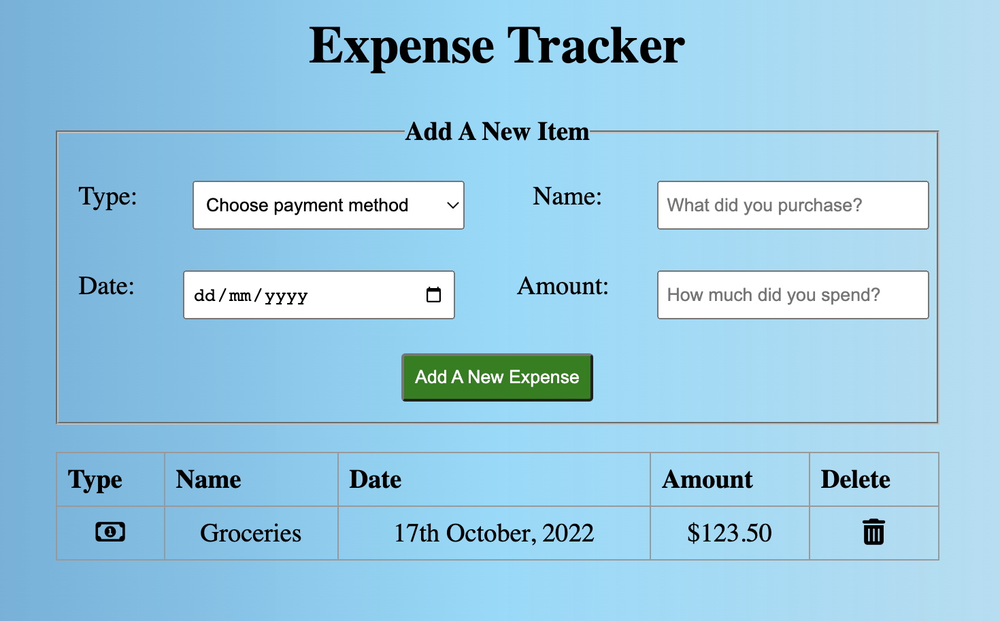

# expense_tracker

A simple Expense Tracker Application.

Languages Used: HTML / CSS / JavaScript

View the application [here](https://jmurrii.github.io/expense_tracker/)

## Summary

In the Sixth exercise of Andy Sterkowitz' Software Development Mastermind Program, I was given the task of creating an Expense Tracker application.
In completing the project I continued to learn about how to manipulate the dom, specifically how to add and delete information to/from a table element dynamically with Javascript.

## Author

John Murray - _Software Developer_

[LinkedIn](https://www.linkedin.com/in/jmurrii/)
